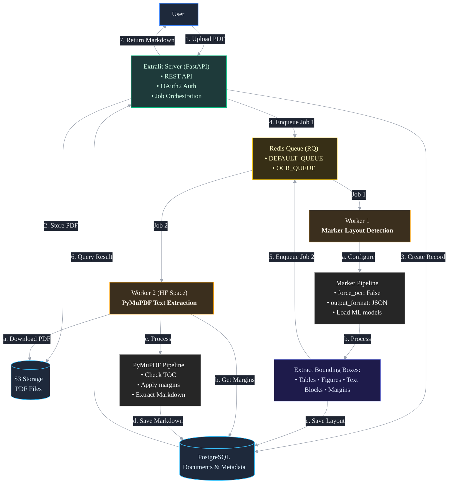

# images

```mermaid
%%{init: {'theme': 'base', 'themeVariables': {
  'background':'#0f1117',
  'primaryColor':'#1f2532',
  'primaryBorderColor':'#4b5563',
  'primaryTextColor':'#e5e7eb',
  'lineColor':'#9ca3af',
  'fontFamily':'Inter, Arial, sans-serif',
  'edgeLabelBackground':'#1f2532'
}}}%%
graph TD

    %% USER INTERACTION
    User["User"] -->|1. Upload PDF| Server

    %% SERVER
    Server["Extralit Server (FastAPI)<br/>• REST API<br/>• OAuth2 Auth<br/>• Job Orchestration"]

    %% STORAGE
    Server -->|2. Store PDF| S3[("S3 Storage<br/>PDF Files")]
    Server -->|3. Create Record| DB[("PostgreSQL<br/>Documents & Metadata")]

    %% JOB QUEUE
    Server -->|4. Enqueue Job 1| Queue["Redis Queue (RQ)<br/>• DEFAULT_QUEUE<br/>• OCR_QUEUE"]

    %% WORKER 1
    Queue -->|Job 1| Worker1["Worker 1<br/><b>Marker Layout Detection</b>"]
    Worker1 -->|a. Configure| MarkerStep["Marker Pipeline<br/>• force_ocr: False<br/>• output_format: JSON<br/>• Load ML models"]
    MarkerStep -->|b. Process| MarkerOutput["Extract Bounding Boxes:<br/>• Tables • Figures • Text Blocks • Margins"]
    MarkerOutput -->|c. Save Layout| DB
    MarkerOutput -->|5. Enqueue Job 2| Queue

    %% WORKER 2
    Queue -->|Job 2| Worker2["Worker 2 (HF Space)<br/><b>PyMuPDF Text Extraction</b>"]
    Worker2 -->|a. Download PDF| S3
    Worker2 -->|b. Get Margins| DB
    Worker2 -->|c. Process| PyMuPDFStep["PyMuPDF Pipeline<br/>• Check TOC<br/>• Apply margins<br/>• Extract Markdown"]
    PyMuPDFStep -->|d. Save Markdown| DB

    %% FINAL OUTPUT
    DB -->|6. Query Result| Server
    Server -->|7. Return Markdown| User

    %% STYLING (Dark mode aesthetic)
    style User fill:#1e293b,stroke:#3b82f6,stroke-width:1.5px,color:#f1f5f9
    style Server fill:#1e3a3a,stroke:#10b981,stroke-width:1.5px,color:#d1fae5
    style S3 fill:#1e293b,stroke:#38bdf8,stroke-width:1.2px,color:#e0f2fe
    style DB fill:#1e293b,stroke:#38bdf8,stroke-width:1.2px,color:#e0f2fe
    style Queue fill:#372f16,stroke:#facc15,stroke-width:1.2px,color:#fef9c3
    style Worker1 fill:#3b2f1e,stroke:#f59e0b,stroke-width:1.2px,color:#fff7ed
    style Worker2 fill:#3b2f1e,stroke:#f59e0b,stroke-width:1.2px,color:#fff7ed
    style MarkerStep fill:#262626,stroke:#a3a3a3,stroke-width:1px,color:#f5f5f5
    style MarkerOutput fill:#1e1b4b,stroke:#818cf8,stroke-width:1px,color:#e0e7ff
    style PyMuPDFStep fill:#262626,stroke:#a3a3a3,stroke-width:1px,color:#f5f5f5


```

